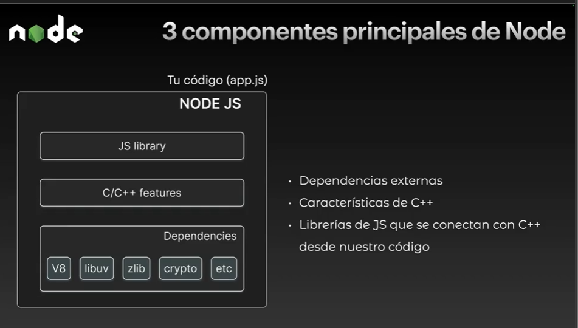
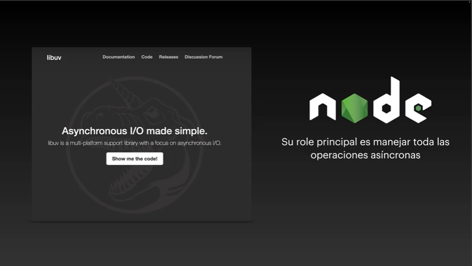
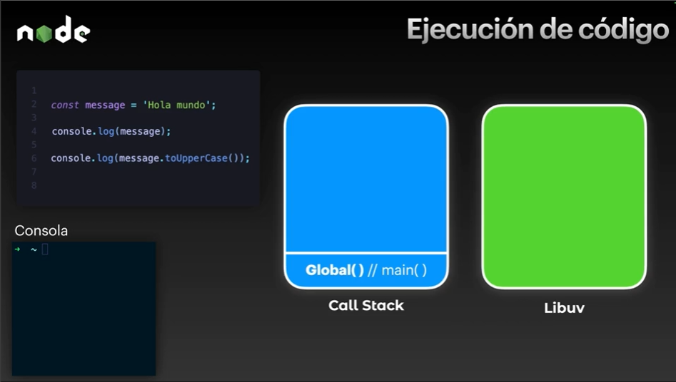
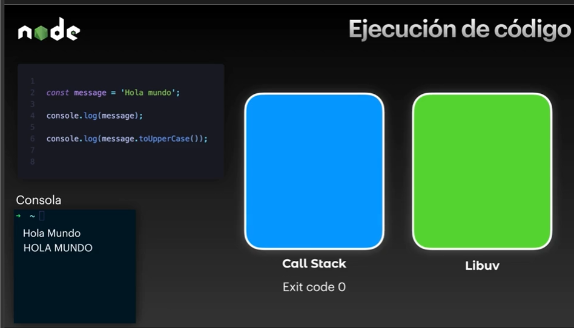
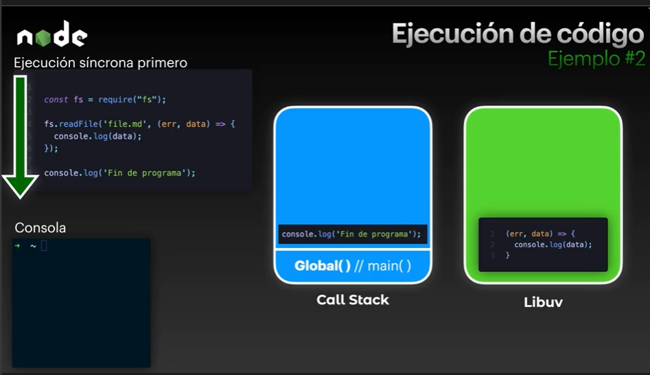
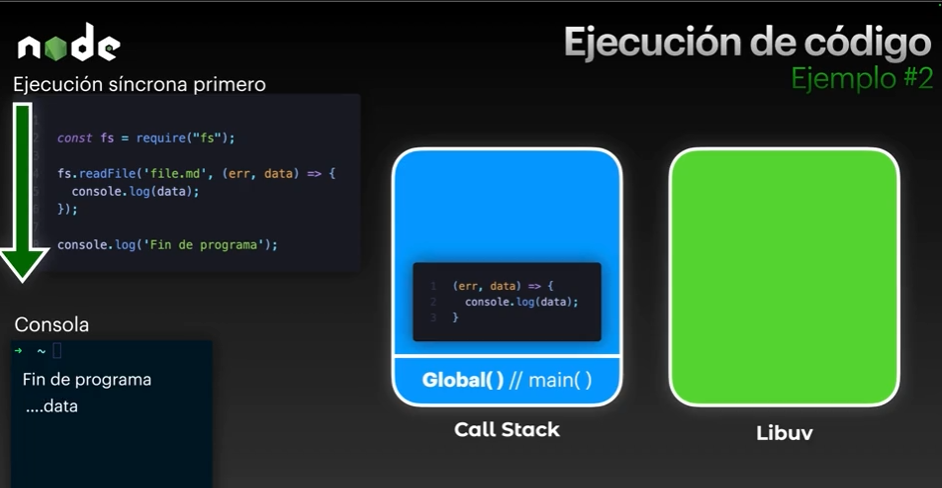
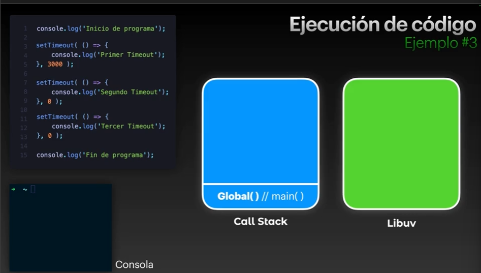
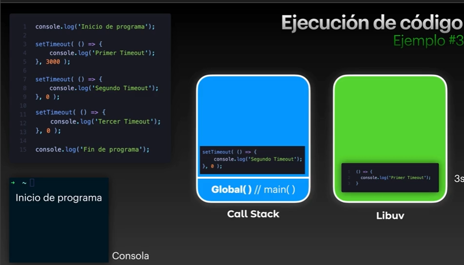
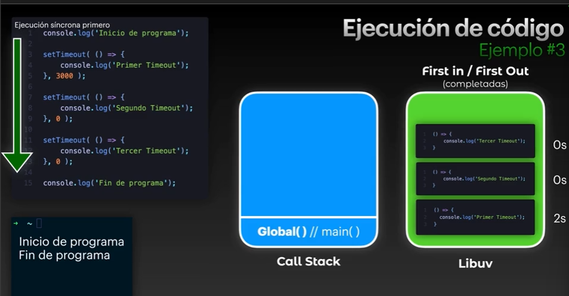
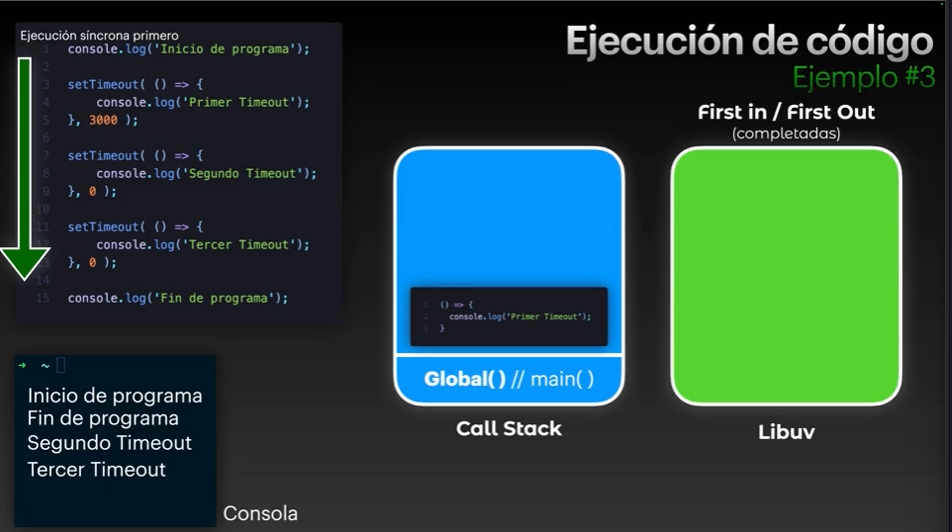

# Node - Code Execution

## Libuv

Es quien va permitir a node poder trabajar en tareas asincronas callback y a lo que estariamos acostumbrados a esperar cuando tenemos un servidor o una apliacion rest que podria resivir millones de solicitudes diarias.

## Ejecucion de codigo en Node/js

Cuando nosotros ejecutamos el nodeApp podria ser un archivo con codigo JS node crea esta funcion global `Global()//main()` esa funcion nos da ciertas variables de entorno entre otras cosas.

La forma en la que se trabaja es toma primera linea de codigo la envia a call stack la ejecuta/registra/anade referencia a file system y la elimina y asi con el resto de lineas generando un Exit code 0 al final cuando todo ha sido ejecutado y sale de nuestra funcion global si no sucede ningun error.

En este caso se puede contemplar un codigo diferente que usa lector de archivos de node , Ahora debemos entender que todo nuestro codigo sincrono se ejecuta en secuencia y nuestro codigo asincrono pasa a Libuv con este ejemplo el callback que recibe el metodo pasa a Libuv
y eso permiter seguir ejecutando el resto de lineas sin bloquear el hilo, una ves lineas sincronas se haya registrado y eliminado nuestro callback pasa al call stack se ejecuta y se elimina de nuestro call stack.

### Ejemplo 3

Este es un ejemplo diferente donde tenemos codigo asincrono.
los callbacks se ejecutan y se pasan a libuv.

Tras transcurrir algunos segundos y algunos callback ya este listos para ejecutarse y eliminarse libuv trabaja con first in / first out eso quiere decir que los que finalizan primero saldran primero,
una ves ya no hay nada pendiente se elimina nuestra funcion global.

