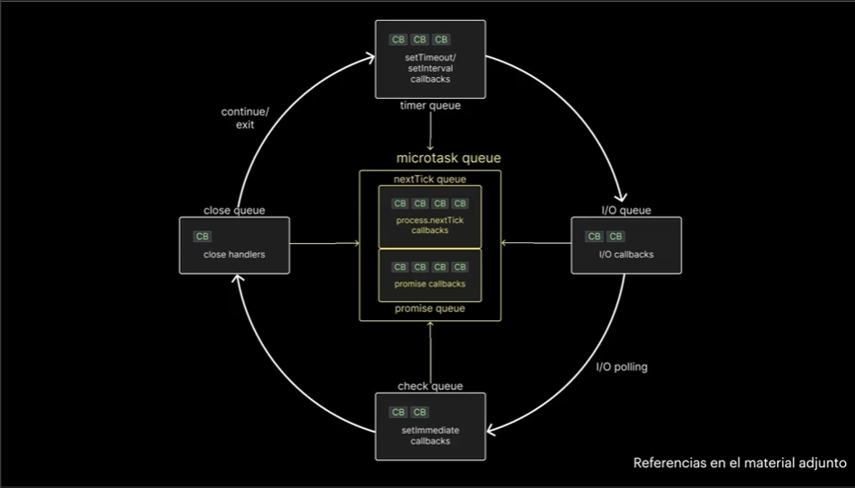
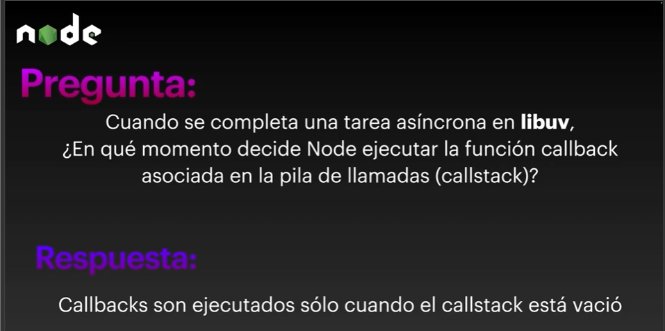
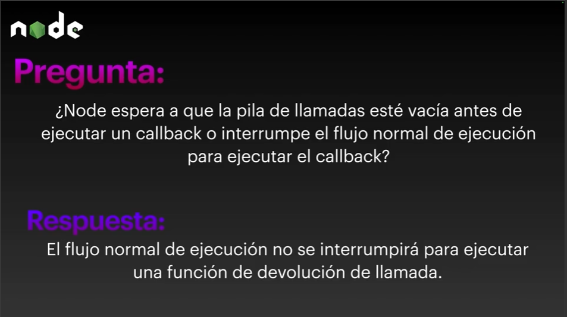
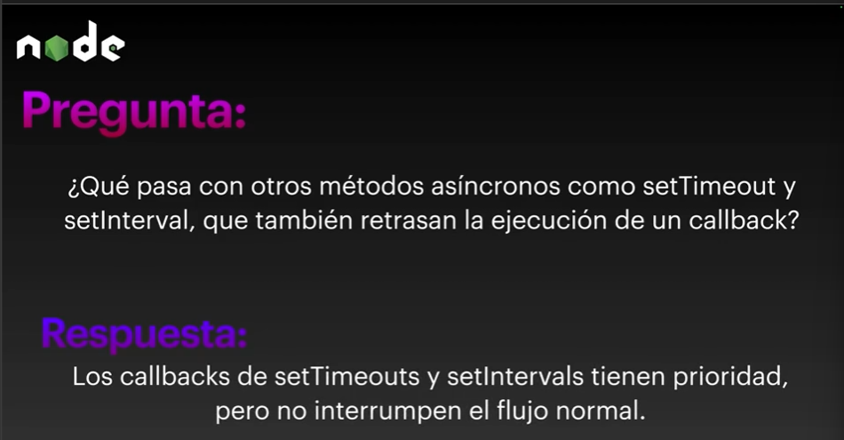
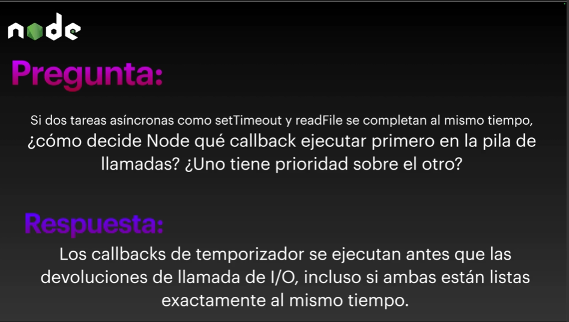

# Event Loop

Es quien decide el orden de ejecucion y hay una serie de reglas.

[https://www.builder.io/blog/visual-guide-to-nodejs-event-loop]

## Reglas

- Callbacks en los microtask se ejecutan primero.

- Todos los callbacks dentro del timer queue se ejecutan.

- Callbacks en el microtask queue(si hay) se ejecutan despues de los callbacks timers , primero que tareas en el nextTick queue y luego tareas en el promise queue.

- Callbacks de I/O se ejecutan.

- Callbacks en el miscrotask queue se ejecutan (si hay), y luego promise queue (si hay)

- Todos los callbacks en el check queue se ejecutan.

- Callbacks en el microtask se ejecutan despues de cada callback en el check queue. (Siguiendo el mismo orden anterior , nextTick y luego promise)

- Todos los callbacks en el close queue son ejecutados

- Por una ultima ves en el mismo ciclo , los microtask queues son ejecutados de  la misma forma , nextTick y luego promise queue.

